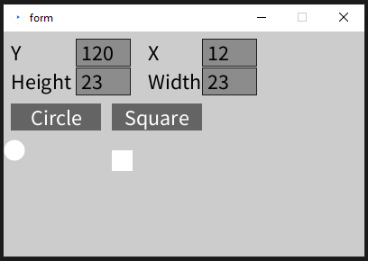

# processing
This project is a JAVA to Python translation of Mitko Nikov's [project](https://github.com/mitkonikov/Processing)

### Features
* Button
* Textbox

### Demo


### Processing
All informations about how to use processing with python you can find on this [Site](https://py.processing.org/).

### How to debug
```python
try:
    YOUR CODE HERE
except Exception as error:
    print(error)
```